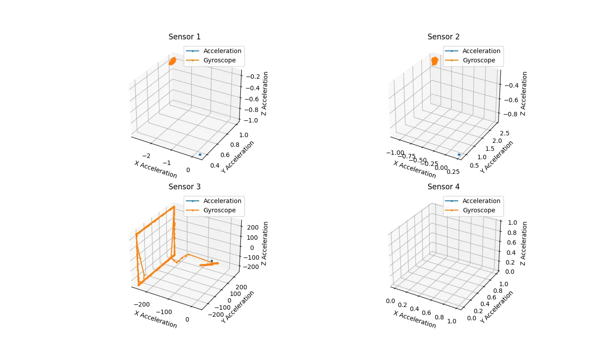
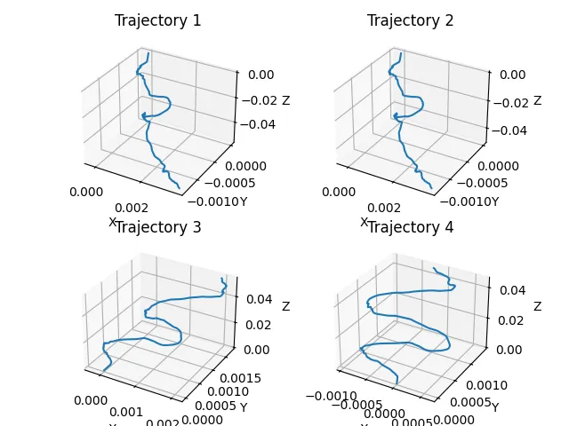

# Human Gesture Reconstruction

---

### Tools:

1. Comparison of each sensor using **Root Mean Square error** and **R-Squared Score**.   
   The code can be found in [sensor_comparitor.ipynb](sensor_comparitor.ipynb).
2. Plot trajectory of the sensor using the acceleration and gyroscope data.  
   The code can be found in [plot_acc_gyr.ipynb](plot_acc_gyr.ipynb).

---

### Experiments:

1. Comparison of each sensors in stationary situation:
   In this experiment all sensors was placed in a stationary situation where none of them could move at all.  
   We calculated the Root Mean Square error and R-Squared Score between each sensor.  
   The experiment files and results can be found in [experiments/stationary](experiments/stationary).

2. You can try [helicopter](experiments/helicopter) experiment where one of the sensors was being rotated in a circular
   motion.
   
3. letter W: Is another experiment which two sensors where moved in a shape of W and the other two were in stationary
   position, you can find
   it [here](experiments/letter_W).  
   

---
#### [Link](https://masoudvahid.notion.site/Human-gesture-recognition-678efa1bb50942c2b9ce1e6c077c99ec?pvs=4) to the notion of this project
